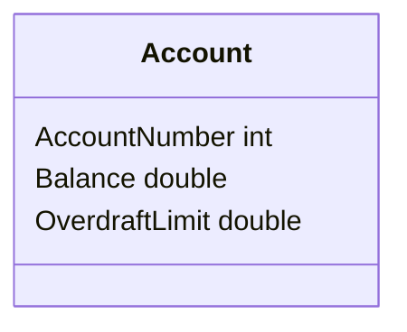
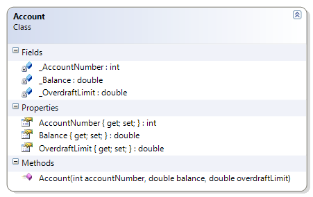

# Account

This simple class also illustrates encapsulation, but with some of the fields being read-only. This necessitates the presence of a constructor. This example includes a driver which shows that a class is in a "known state" as soon as it is created.

<mermaid>

</mermaid>

