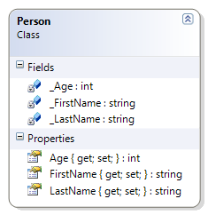

# Person

This simple class illustrates and introduces the idea of encapsulation (private fields with public properties). This example does not have a constructor. This example includes a driver. The driver is also used to illustrate how, with only fields & getter/setter methods, an object can be in an "unknown" (and invalid) state as soon as it is created; this idea is introduced to show the need for a constructor, and opens the discussion of the idea of a "default constructor".

