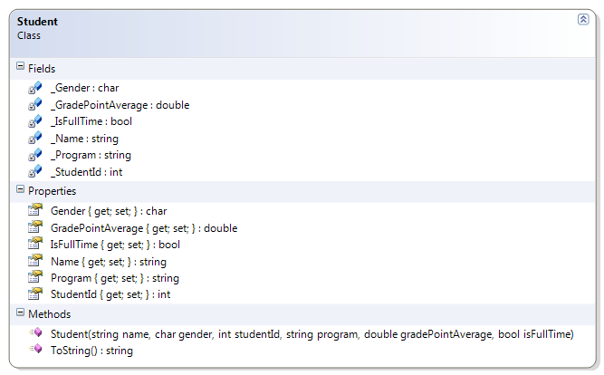

---
---
# Student

This class reinforces the idea of encapsulation and constructors. It also introduces the idea of overloading the default ToString() method that every class inherits from the Object class. This example includes a driver with multiple objects, showing how the use of constructors makes it easier to create many objects in a few lines of code.

