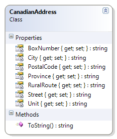

# CanadianAddress

This class represents an address for some place in Canada. 

**Problem Statement:**

Create the CanadianAddress class so that it can represent the majority of possible addresses that some place may have in Canada. Design the class to use auto-implemented properties as specified in this class diagram. No constructor is required for this class.

 
Also create a driver for testing this class; you may use any name for the driver as long as it is not already mentioned in this namespace. In the driver, create two instances of the CanadianAddress class that represent your current address as well as the address of your school (use hard-coded data). 
