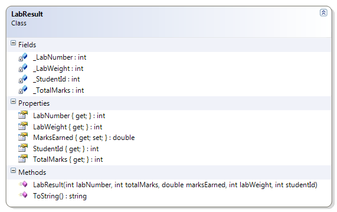

---
---
# LabResult

This class represents the results of a lab for a student. 

**Problem Statement:**

Create the LabResult class so that it represents the results of a lab submitted by a student. Design the class to have the fields, properties, and constructor as specified in this document. Also create a ToString() method that describes the information in any given instance of this class.

Use an auto-implemented property for the MarksEarned; use fields as the "backing store" for all other properties.

Note that the following properties should not have "set" implementations: TotalMarks, LabNumber, LabWeight, and StudentId. 



Here are some XML comments to describe the ToString( ) method.

```csharp
/// <summary>
/// This method overrides the default ToString() method to display 
/// more meaningful information about this object.
/// </summary>
/// <returns>A string displaying the StudentId, MarksEarned, and 
/// TotalMarks.</returns>
/// <remarks>
/// A call to this method (such as <c>Lab4.ToString()</c>) 
/// would produce the following result:
/// <code>The student (200702694) received 24.5/35 for this lab.</code>
/// </remarks>
```

Also create a driver for testing this class; you may use any name for the driver as long as it is not already mentioned in this namespace. In the driver, instantiate all of the labs you have submitted to date in any course and populate those objects with data (use hard-coded data); if you haven't had any labs as of yet, then make up some data.
