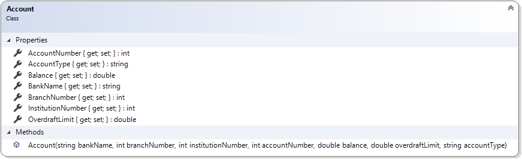

# Account

This simple class also illustrates encapsulation, but with some of the fields being read-only. This class uses a constructor (which is also necessary for getting state into fields which do not have corresponding setter methods).

Should…
* Get Bank Name
* Get Branch Number
* Get Institution Number
* Get Account Number
* Get Account Type
* Get/Set Balance
* Get/Set Overdraft Limit
