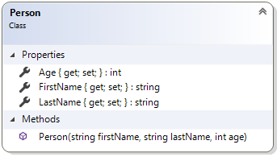

# Person

This simple class was used to introduce the idea of encapsulation (private fields with public getters and setters). This example uses a constructor for ensuring the state of an object when it is instantiated (created). In this topic, it is used to demonstrate unit testing.

## Background

The following diagram represents the last design for the Person class, as completed in the exercises portion of the previous topic.


From there, the practice portion added a constructor.



At this point, the code for the Person class looks like this:

```csharp
public class Person
{
    public string FirstName { get; set; }
    public string LastName { get; set; }
    public int Age { get; set; }
    public Person(string firstName, string lastName, int age)
    {
        FirstName = firstName;
        LastName = lastName;
        Age = age;
    }
}
```

## Unit Testing

We can use unit testing to ensure that we have coded the class correctly. Use the following to add a NuGet package to your project that will create the appropriate tests.

```shell
```

Next, add the following code to set up the predefined tests in your project.

```csharp
public class SelfCheck_D1_Person : Examples.Specs.D1_Person<Topic.D.Examples.Person>
{
}
```

The supplied unit tests check all of this previously documented behaviour, but they also check to see if the Person class has overridden the `ToString()` method. Because this requirement is new, and has not yet been implemented, the unit tests show this as a "failed test." The following diagram is the design that the unit tests are evaluating.


Effectively, the Person class should…

- Instantiate (build) from constructor
- Get/Set First Name
- Get/Set Last Name
- Get/Set Age
- Override ToString() to get the person's full name (as first name then last name)
  - **The test for this method will report as "failed" because it has not yet been implemented.**

To make the Person class pass the final test, we add the `ToString()` method.

```csharp
public override string ToString()
{
    return $"{FirstName} {lastName}";
}
```

When the tests are re-run, they pass.
