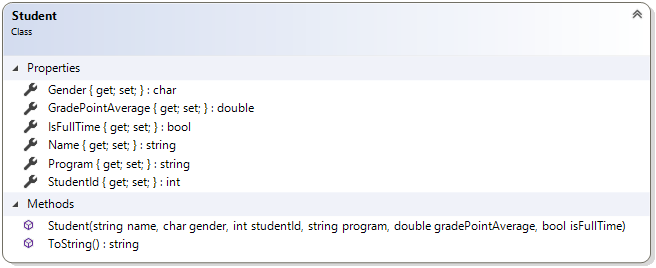

# Student

This class reinforces the idea of encapsulation and constructors. It also demonstrates the idea of overloading the default ToString() method that every class inherits from the Object class.

Should…
* Get/Set Name
* Get/Set Gender
* Get/Set Student Id
* Get/Set GPA
* Get/Set Program
* Get/Set Full-Time
* Override ToString() to get the student's ID and name
