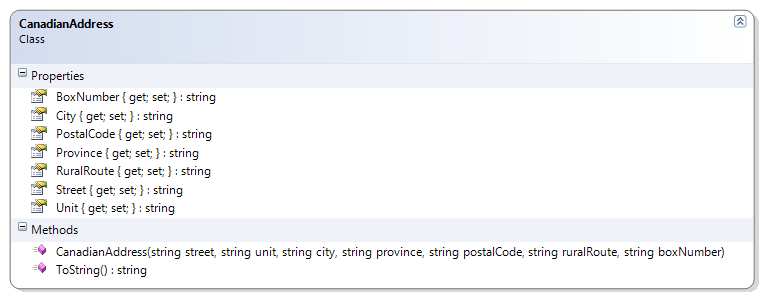

# CanadianAddress

Should…
* Instantiate (build) from Constructor
* Get/Set: Street, Unit, City, Province, Postal Code, Rural Route, Box Number
* Override ToString() to just show Street, City, Province, and Postal Code
