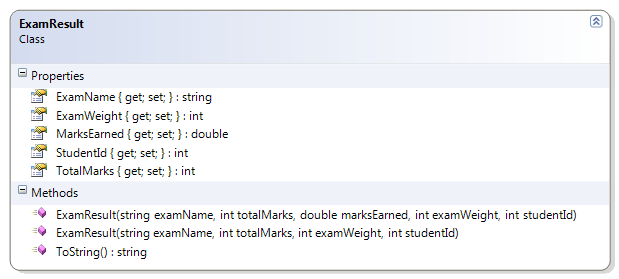

# ExamResult

Should…
* Instantiate from Constructor
* Get/Set: Marks Earned
* Get: Name, Student Id, Total Marks, Exam Weight
* Override ToString() to show 
  "The student (studentId) received earnedMarks/totalMarks for this examName exam."
