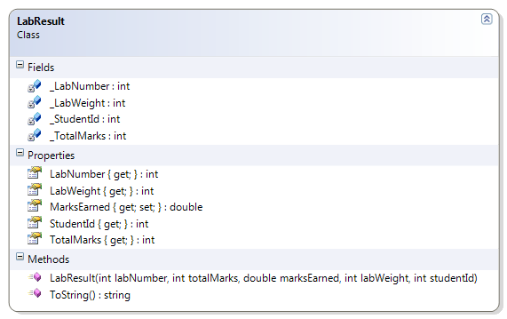

---
---
# LabResult

 
Should…
* Instantiate from Constructor
* Get/Set: Marks Earned
* Get: Lab Number, Student Id, Total Marks, Lab Weight
* Override ToString() to show 
  "The student (studentId) received earnedMarks/totalMarks for this lab."

