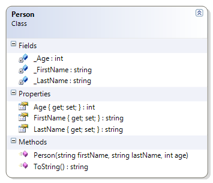

# Person

This simple class was used to introduce the idea of encapsulation (private fields with public properties). This example uses a constructor for ensuring the state of an object when it is instantiated (created). It also demonstrates the overriding of the ToString() method inherited from the Object method.

Should…
* Instantiate (build) from constructor
* Get/Set First Name
* Get/Set Last Name
* Get/Set Age
* Override ToString() to get the person’s full name (as first name then last name)
