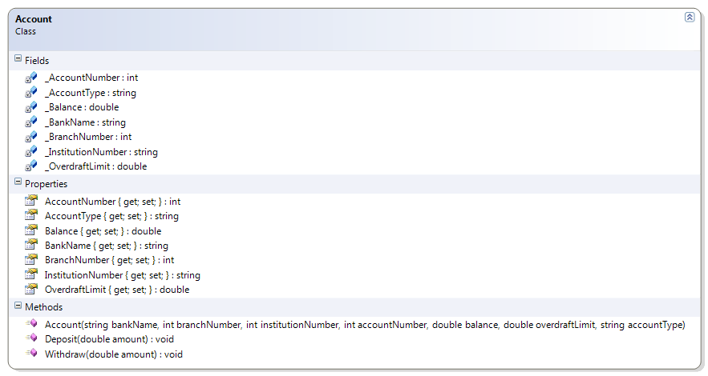

# Account

This class illustrates simple addition and calculation by allowing deposits and withdrawals. Note that changes to the balance can now only be made through deposits and withdrawals; the balance is now "read-only". 

**Problem Statement**

Write the code that will represent a simple bank account. 

The solution must meet the following requirements (new requirements are in **bold**):

* Should get the bank name, branch number, institution number, account number, balance, overdraft limit, and account type
* Should allow the overdraft limit to be set
* **Should support deposits and withdrawals**

Use the following class diagram when creating your solution.



```csharp
  public void Withdraw(double amount)
  {
      Balance -= amount;
  }

  public void Deposit(double amount)
  {
      Balance += amount;
  }
```
