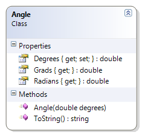

# Angle

This class represents an angle and provides the value in the following units: degrees, radians and grads. It also gives a simple example of unicode characters (for degrees).

**Problem Statement**

Write the code for the Angle class. The solution must meet the following requirements:

* Should get and set the angle's value (in degrees)
* Should calculate the equivalent angle in Radians and Grads, using the following formulas:
* Radians = Degrees * (π / 180)
* Grads = Radians * (200 / π)
* Should override the ToString() method to return the angle in degrees, in the following format:
* degrees°
* The Unicode character for the degrees symbol (°) is '\u00B0'

Use the following class diagram when creating your solution.



```csharp
using System;
namespace Topic.E.Examples
{
    public class Angle
    {
        public Angle(double degrees)
        {
            this.Degrees = degrees;
        }

        public double Degrees { get; set; }

        public double Radians
        {
            get
            {
                double radians = Degrees * (Math.PI / 180);
                return radians;
            }
        }

        public double Grads
        {
            get
            {
                double grads = Radians * (200 / Math.PI);
                return grads;
            }
        }

        // http://unicode.org/notes/tn28/UTN28-PlainTextMath.pdf
        // Page 40 of the above reference for the degree symbol
        public override string ToString()
        {
            return Degrees.ToString() + '\u00B0';
        }
    }
}
```
