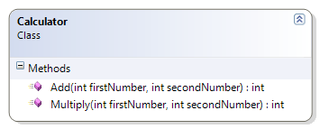

---
---
# Calculator

This class introduces simple arithmetic operations, demonstrating simple addition and multiplication.

**Problem Statement**

Write the code that will act as a calculator for doing math. This first version must be a working prototype; as a prototype, it does not have to support all of the features of the final product. 

The solution must meet the following requirements:

* Should add two whole numbers.
* Should multiply two whole numbers.

Use the following class diagram when creating your solution. Since this class does not have properties or fields, make the methods static.



```csharp
public class Calculator
{
    public static int Add(int firstNumber, int secondNumber)
    {
        return firstNumber + secondNumber;
    }

    public static int Multiply(int firstNumber, int secondNumber)
    {
        return firstNumber * secondNumber;
    }
}
```
