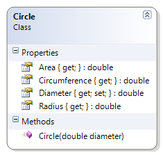

# Circle

This class represents a simple circle of a specified diameter. The radius, area and circumference are calculated. 

**Problem Statement**

Write the code for the Circle class. The solution must meet the following requirements:

* Should get and set the diameter
* Should calculate the area, radius, and circumference

Use the following class diagram when creating your solution.


 
```csharp
using System;
namespace Topic.E.Examples
{
    public class Circle
    {
        public Circle(double diameter)
        {
            this.Diameter = diameter;
        }

        public double Diameter { get; set; }

        public double Radius
        { get { return Diameter / 2; } }

        public double Circumference
        { get { return Math.PI * Diameter; } }

        public double Area
        { get { return Math.PI * Radius * Radius; } }
    }
}
```
