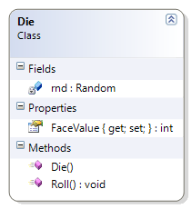

# Die

This class represents a single six-sided die. This example is used to illustrate random number generation and casting.

**Problem Statement**

Write the code for the Die class. The solution must meet the following requirements:

* Should generate a random value from 1 to 6, when initially created and when re-rolled
* Should get the face value of the die

Use the following class diagram when creating your solution. Note that this uses the Random class as a private static field.



```csharp
using System;
namespace Topic.E.Examples
{
    public class Die
    {
        private static Random rnd = new Random();

        public Die()
        {
            Roll();
        }

        public int FaceValue { get; private set; }

        public void Roll()
        {
            FaceValue = rnd.Next(6000) % 6 + 1;
        }
    }
}
```
