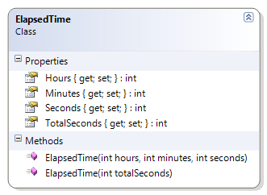

---
---
# ElapsedTime

This class demonstrates overloaded constructors and introduces the concepts of operator precedence and integer division.

**Problem Statement**

Write the code that will represent a period of elapsed time for a competitor in a marathon. It should be able to represent its information in two forms:

* Hours, minutes and seconds, and
* Total seconds. 

The solution must meet the following requirements:

* Should calculate the hours, minutes and seconds given the total seconds
* Should calculate the total seconds given the hours, minutes and seconds

Use the following class diagram when creating your solution.



```csharp
public class ElapsedTime
{
    public ElapsedTime(int hours, int minutes, int seconds)
    {
        TotalSeconds = hours * 60 * 60;
        TotalSeconds += minutes * 60;
        TotalSeconds += seconds;

        Hours = hours;
        Minutes = minutes;
        Seconds = seconds;
    }

    public ElapsedTime(int totalSeconds)
    {
        Hours = totalSeconds / (60 * 60);
        Minutes = (totalSeconds - Hours * 60 * 60) / 60;
        Seconds = totalSeconds - Hours * 60 * 60 - Minutes * 60;

        TotalSeconds = totalSeconds;
    }

    public int Hours { get; private set; }

    public int Minutes { get; private set; }

    public int Seconds { get; private set; }

    public int TotalSeconds { get; private set; }
}
```
