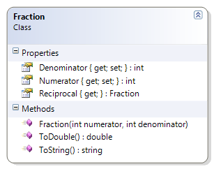

# Fraction

This class represents a fraction as a numerator and denominator. It provides the double equivalent of the fraction's value as well as a string representation that uses the numerator and denominator. It demonstrates type casting and the integer division issue. 

**Problem Statement**

Write the code for the Fraction class. The solution must meet the following requirements:

* Should get the string representation of the fraction, as "____numerator____/____denominator____"
* Should get the numeric value of the fraction (as a real number)
* Should get the reciprocal of the fraction

Use the following class diagram when creating your solution.



```csharp
public class Fraction
{
    public int Numerator { get; private set; }

    public int Denominator { get; private set; }

    public Fraction(int numerator, int denominator)
    {
        Numerator = numerator;
        Denominator = denominator;
    }

    public Fraction Reciprocal
    {
        get { return new Fraction(Denominator, Numerator); }
    }

    public override string ToString()
    {
        string stringValue = "";
        stringValue += Numerator + "/" + Denominator;
        return stringValue;
    }

    public double ToDouble()
    {
        // The casting of numerator to a double helps
        // ensure that we don't lose any fractional
        // portion due to integer division.
        double value = (double)(Numerator) / Denominator;
        return value;
    }
}
```
