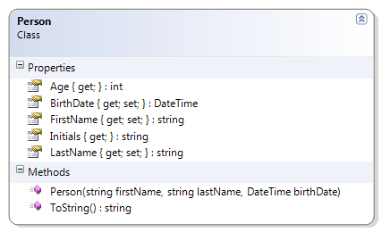

# Person

This adaptation of the person class changes the previous design by replacing the age field with a "read-only" field for the person's birth date. The approximate age of the person is then calculated based on the current date and the birth date. 

**Problem Statement**

Write the code that will represent a person with a first and last name and a date of birth.
The solution must meet the following requirements (new requirements are in **bold**):
* Should get and set the first and last name
* **Should get the birth date**
* **Should get the person's approximate age (which is the age that the person will turn to in the current year)**
* **Should get the person's initials**
* Should override ToString() to get the person's full name (as first name then last name)

Use the following class diagram when creating your solution.


 
```csharp
public class Person
{
    public string FirstName { get; set; }

    public string LastName { get; set; }

    public DateTime BirthDate { get; private set; }

    public int Age
    {
        get
        {
            int currentAge = 0;
            currentAge = DateTime.Today.Year - BirthDate.Year;
            return currentAge;
        }
    }
    public Person(string firstName, string lastName, DateTime birthDate)
    {
        FirstName = firstName;
        LastName = lastName;
        BirthDate = birthDate;
    }


    public override string ToString()
    {
        return FirstName + " " + LastName;
    }

    public string Initials
    {
        get
        {
            return FirstName[0] + "." + LastName[0] + ".";
        }
    }
}
```
