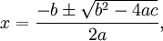

---
---
# QuadradicEquation

This class is used to solve for the two possible values of a quadratic formula where quadratic equals zero. It is based off of the following formula.



This sample illustrates order of operations and parentheses.

**Problem Statement**

Write the code that will represent a quadratic equation that has a higher and lower root. It is to use the Quadratic formula, which states:

For `ax^2 + bx + c = 0`$, the value of ***x*** is given by


 
More information on the quadratic formula can be found at http://www.purplemath.com/modules/quadform.htm.

The solution must meet the following requirements:

* Should get the lower root, using the quadratic formula
`x=(-b-√(b^2-4ac))/2a`$
* Should get the higher root, using the quadratic formula
`x=(-b+√(b^2-4ac))/2a`$
* Should overload the ToString() method to represent the quadratic formula showing the values for ***a***, ***b*** and ***c*** in the following format:
  ***____a____x2 + ____b____x + ____c____ = 0***
  For example, given the values of 1, 3 and -4 for ***a***, ***b*** and ***c*** respectively, the method should produce
  ***1x2 + 3x + -4 = 0***

Use the accompanying class diagram when creating your solution.


```csharp
using System;
namespace Topic.E.Examples
{
    public class QuadraticEquation
    {
        private int a;
        private int b;
        private int c;

        public QuadraticEquation(int a, int b, int c)
        {
            this.a = a;
            this.b = b;
            this.c = c;
        }

        public double LowerRoot
        {
            get
            {
                double value;
                value = (-b - Math.Sqrt(b * b - 4 * a * c)) / (2 * a);
                return value;
            }
        }

        public double HigherRoot
        {
            get
            {
                double value;
                value = (-b + Math.Sqrt(b * b - 4 * a * c)) / (2 * a);
                return value;
            }
        }


        public override string ToString()
        {
            return a.ToString() + "x^2 + " + b + "x + " + c + " = 0";
        }
    }
}
```
