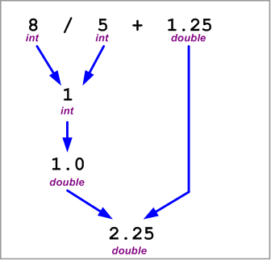

---
---
# ResolveExpressions

This class is used in conjuncture with several sample expressions that illustrate operator precedence and automatic type conversion.

**Problem Statement**

Write the code that will provide the final value for the expressions in the following exercise (as a solution for a student's exercise).

***Expressions Exercise***

On a piece of paper, evaluate the following expressions to show the final value and the data type of the final value. Show the order in which the operations are evaluated.

1. 10.0 + 15 / 2 + 4.3
2. 8 / 5 + 1.25
3. 10.0 + 15.0 / 2 + 4.3
4. 3.0 * 4 / 6 + 6
5. 3.0 * (4 % 6) + 6
6. 3 * 4.0 / 6 + 6
7. 20.0 - 2 / 6 + 3
8. 10 + 17 % 3 + 4
9. (10 + 17) % 3 +4.0
10. 10 + 17 / 4.0 + 4

The solution for question 2 is provided as an example. Use the accompanying class diagram when creating your coded solution as proof of your final answers.

 

```csharp
namespace Topic.E.Examples
{
    public class ResolveExpressions
    {
        public static double Sample1
        { get { return 10.0 + 15 / 2 + 4.3; } }

        public static double Sample3
        { get { return 10.0 + 15.0 / 2 + 4.3; } }

        public static double Sample4
        { get { return 3.0 * 4 / 6 + 6; } }

        public static double Sample5
        { get { return 3.0 * (4 % 6) + 6; } }

        public static double Sample6
        { get { return 3 * 4.0 / 6 + 6; } }

        public static double Sample7
        { get { return 20.0 - 2 / 6 + 3; } }

        public static int Sample8
        { get { return 10 + 17 % 3 + 4; } }

        public static double Sample9
        { get { return (10 + 17) % 3 + 4.0; } }

        public static double Sample10
        { get { return 10 + 17 / 4.0 + 4; } }
    }
}
```
