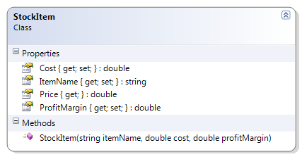

# StockItem

This class represents an item that is part of an inventory. The item has an item name, a cost and a profit margin (which can be positive or negative). By using the profit margin, it can derive the price of the item. This example illustrates rounding.

**Problem Statement**

Write the code for the StockItem class. The solution must meet the following requirements:

* Should get and set the name, cost and profit margin of the stock item
* Should calculate the price of the item, to the nearest cent, using the profit margin as a percent (a profit margin of 45 means 45%)
* Use the rounding where values under a half-cent are rounded down and values greater than or equal to a half-cent are rounded up

Use the following class diagram when creating your solution.



```csharp
using System;
namespace Topic.E.Examples
{
    public class StockItem
    {
        public double Cost { get; set; }

        public double ProfitMargin { get; set; }

        public StockItem(string itemName, double cost, double profitMargin)
        {
            this.ItemName = itemName;
            this.Cost = cost;
            this.ProfitMargin = profitMargin;
        }

        public string ItemName { get; set; }

        public double Price
        {
            get
            {
                // Round to the nearest cent
                double price = Cost;
                price += Cost * (ProfitMargin / 100);
                return Math.Round(price * 100) / 100.0;
            }
        }
    }
}
```
