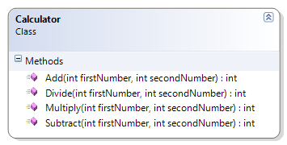

# Calculator

This exercise expands on the original Calculator class to perform subtraction and division with integers.

**Problem Statement**

Write the code that will act as a calculator for doing math. This version is a follow-up on the previous prototype; now it should support subtraction and division.

The solution must meet the following requirements:

* Should add two whole numbers.
* Should multiply two whole numbers.
* Should subtract two whole numbers.
* Should divide two whole numbers.

Use the following class diagram when creating your solution.

