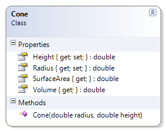

---
---
# Cone

The Cone class represents a conical object whose height and base radius is known. The class provides methods to determine the volume and surface area with this information.

**Problem Statement**

Write the code for the Cone class that meets the following requirements:

* The Radius and Height properties should have a private set.
* Should get the radius and the height
* Should calculate the volume and the surface area
  * `Volume of a Cone = 1/3 * pi * r^2 * h`$
  * `Surface Area of a Cone = pi * r^2 + pi * r * sqrt(r^2 + h^2)`$

Note that the portion `sqrt(r^2 + h^2)`$ is known as the slant height.

Use the following class diagram when creating your solution.

