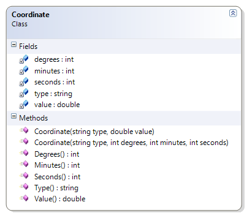

# Coordinate

***Not Yet Implemented*** The Coordinate class represents a geographical co-ordinate for either longitude or latitude. A Coordinate's value can be expressed either as a real number or as degrees, minutes and seconds. It makes use of integer division and overloaded constructors.

**Problem Statement**

Write the code needed to represent a geographical co-ordinate for longitude and latitude. The solution must meet the following requirements:

* Should get the type of coordinate (such as "longitude" or "latitude")
* Given the hours, minutes and seconds, it
  * should calculate coordinate value as a real number
  * should get hours, minutes, and seconds
* Given the coordinate value as a real number, it
  * should calculate the hours, minutes and seconds
  * should get the coordinate value as a real number

Use the following class diagram when creating your solution.

