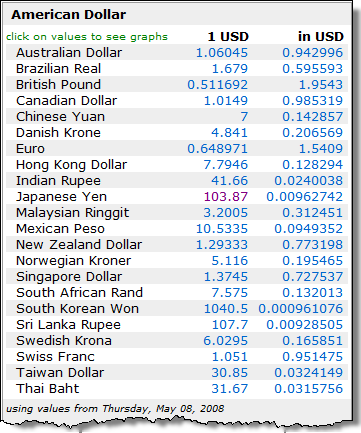

---
---
# CurrencyCalculator

The CurrencyCalculator allows the conversion of US dollars to four other currencies, given the current exchange rate of those currencies.

**Problem Statement**

A currency exchange store at the international airport needs a program to convert from US dollars to four other currencies: Canadian dollar, Euro, Japanese Yen, and the Great Britain Pound. The store uses a set exchange rate for each currency as established at the start of the day. Write the code for a class called CurrencyCalculator to meet this need. The solution must meet the following requirements:

* Should correctly convert US dollars to the 
  * British Pound (GBP)
  * Canadian Dollar (CAD)
  * Euro (EUR)
  * Japanese Yen (JPY)
* Should use the correct level of precision when making the exchange; each currency uses a different number of significant digits:
  * CAD, GBP and EUR use two digits
  * JPY uses three digits

To illustrate the possible exchange rates, please refer to the following images.




Use the following class diagram when creating your solution.


As a starter, you can use the following code to begin creating your class.

```csharp
public class CurrencyCalculator
{
    // The following are multipliers to convert the
    // US dollar to different currencies.
    /* The multiplier to convert US dollars to Canadian dollars. */
    private double _ToCanadian;  // CAD - Canadian Dollar
    /* The multiplier to convert US dollars to the Euro. */
    private double _ToEuro;      // EUR - Euro
    /* The multiplier to convert US dollars to the Japanese Yen. */
    private double _ToYen;       // JPY - Japanese Yen
    /* The multiplier to convert US dollars to the British Pound. */
    private double _ToPound;     // GBP - Great Britain Pound
    
    /* The number of significant digits for the Canadian dollar.
     * The unit for portions of a dollar is the Cent. */
    private static int _CadDigits = 2; // Cents
    /* The number of significant digits for the Euro.
     * The unit for portions of a dollar is the Cent. */
    private static int _EuroDigits = 2; // Cents
    /* The number of significant digits for the Japanese Yen.
     * The unit for 1/100<sup>th</sup> portions of the Yen is the Sen,
     * while each 1/1000<sup>th</sup> is known as a Rin. */
    private static int _YenDigits = 3; // 1/100 is sen, 1/1000 is rin
    /* The number of significant digits for the British Pound.
     * The unit for portions of a Pound is the Pence (or P). */
    private static int _PoundDigits = 2; // Pence (or p)
    
    /*
     * This constructor initializes a CurrencyCalculator object
     * by taking the supplied parameter values and storing
     * them in the fields of this instance of the class.
     */
    public CurrencyCalculator(double toCanadian, double toEuro, double toYen,
            double toPound)
    {
        // Your code goes here...
    }

    /* ************** Methods **************** */
    // Your code goes here...
}
```
