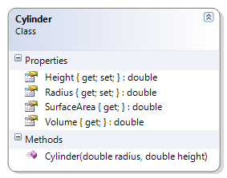

# Cylinder

The Cylinder class represents a cylindrical object whose height and radius is known. The class provides methods to calculate the volume and surface area.

**Problem Statement**

Write the code for the Cylinder class that meets the following requirements:

* The Radius and Height properties should have a private set.
* Should get the radius and the height
* Should calculate the volume and the surface area
  * `Volume of a Cylinder = pi * r^2 * h`$
  * `Surface Area of a Cylinder = 2 * pi * r^2 + 2 * pi * r * h`$

Use the following class diagram when creating your solution.

