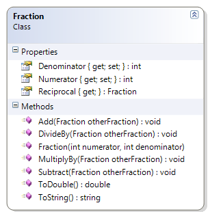

# Fraction

This exercise expands on the original Fraction class to include methods that allow for adding, subtracting, multiplying, and dividing fractions.

**Problem Statement**

Write the code needed to expand the capabilities of the Fraction class. The class must now support the ability to add, subtract, multiply, and divide fractions as well as allow the individual numerator and denominator values to be seen. The solution must meet the following requirements:

* Should get the string representation of the fraction, as "numerator/denominator"
* Should get the numeric value of the fraction (as a real number)
* Should get the reciprocal of the fraction
* Should get the numerator and denominator
* Should add another fraction to its existing value
* Should subtract another fraction from its existing value
* Should multiply its existing value by another fraction
* Should divide its existing value by another fraction

As an assist, the following code can be used for the multiplication method.

```csharp
  public void multiplyBy(Fraction otherFraction)
  {
      this.numerator = this.numerator * otherFraction.numerator;
      this.denominator = this.denominator * otherFraction.denominator;
  }
```

Use the following class diagram when creating your solution.


