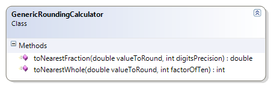

# GenericRoundingCalculator

This exercise demonstrates rounding to the nearest whole number of fractional number using a couple of "generic" methods.

**Problem Statement**

Write the code needed to perform rounding to either whole numbers or fractions at a specified level of precision. The solution must meet the following requirements:

* All of the methods should be static.
* Should correctly round up or down to the nearest whole number, such as
  * the nearest thousand
  * the nearest hundred
  * the nearest ten
  * the nearest one
* Should correctly round up or down to the nearest fractional value, such as
  * the nearest tenth
  * the nearest hundredth

Use the following class diagram when creating your solution.

