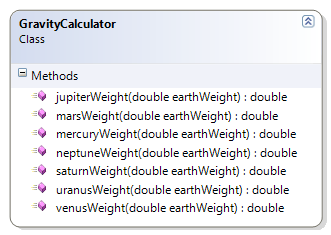

---
---
# GravityCalculator

The GravityCalculator provides static methods for determining an object's weight for the various planets in our solar system, given the equivalent weight as found on Earth.

**Problem Statement**

Write the code needed to convert Earth weights to their equivalent for the other planets in our solar system. The solution must meet the following requirements:

* All the methods should be static.
* Should convert a weight in Earth kilograms to their equivalent weight on
  * Mercury
  * Venus
  * Mars
  * Jupiter
  * Saturn
  * Uranus
  * Neptune
    * For information on equivalent weights among the planets, see these URLS.
      * NinePlanets.org
      * http://www.serve.com/chunter/index/info/aweigh.html

Use the following class diagram when creating your solution.

