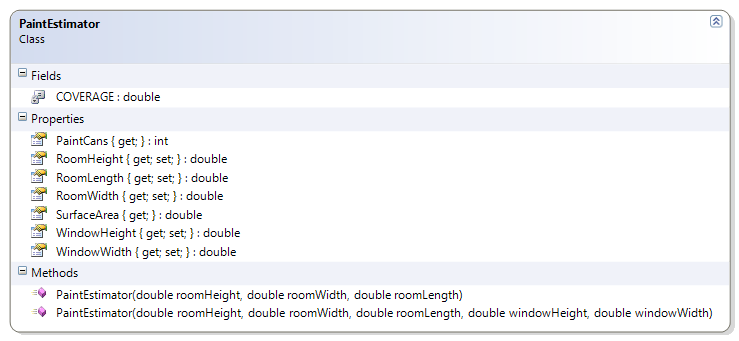

# PaintEstimator

The PaintEstimator class is used to estimate the number of paint cans needed for painting a simple room (with or without a window). It makes use of a constant and the Math library; it also uses overloaded constructors.

**Problem Statement**

Write the code needed to help a painter to estimate the number of paint cans to paint simple rooms (with or without a window). The solution must meet the following requirements:

* Uses a constant value of 8.0 for the paint coverage. (8 square metres per can)
* Should get room height, width, and length
* Should get and set the window's width and height
* Should calculate the number of paint cans for the room and the window
* Should calculate the surface area to be painted
* The room's height, length and width should have a private set property.

Use the following class diagram when creating your solution.

