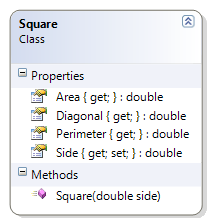

# Square

This exercise expands on the original Square class to include a method that determines the diagonal of a square.

**Problem Statement**

Write the code needed to add the ability for a Square to determine the length of its diagonal. The solution must meet the following requirements:

* Should get and set the length of the side of the square.
* Should calculate the area, perimeter, and diagonal of the square.

Use the following class diagram when creating your solution.

