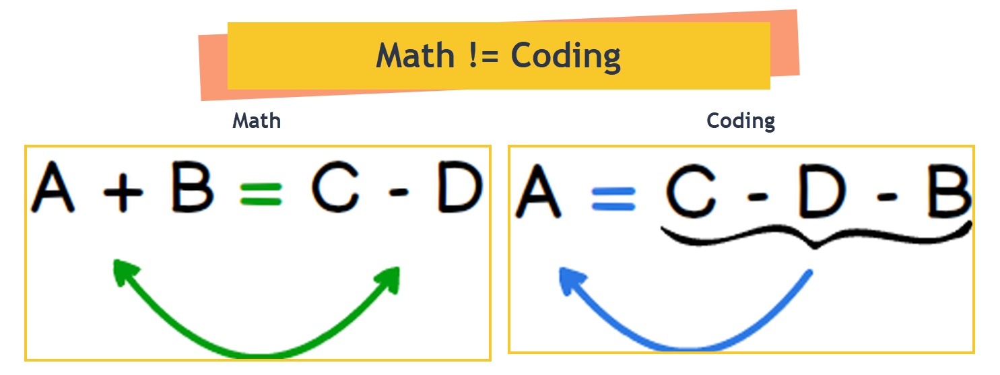

# Topic E – Expressions and Math

::: tip Overview & Logs
If you want a quick bullet-list of the the keywords and topics covered, see the [**Overview**](Overview.md). If you want to check yourself on what you're learning, run through the [**Learning Outcome Guide**](LOGs.md) for this topic. You can also jump to the code in [**Examples**](Examples/ReadMe.md) or [**Practice**](Practice/ReadMe.md).
:::

Doing math and writing code are not the same thing. Sure, there's overlap between math and coding, but there are a lot of significant (if under-recognized) differences.

For example, let's look at the humble equal sign: `=`. In math, the equal sign means "both sides *are* the same". In coding, it *never* means that! In coding, the equal sign is called the **assignment operator** and it's purpose is to *store* information.

That's not the only difference in regards to the equal sign. Note that there is a left-hand side (*lh*) of the equal sign, and a right-hand side (*rh*) of the equal sign. In math, you can have any kind of expression on the left-hand side and the right-hand side. In C#, the item on the left-hand of an equal sign *must* be a variable (because that is the *target* of the *assignment operation*).



Then there's the notion of multiple equations in math. Take the following equations, for example:

- a^2^ + b^2^ = c^2^
- a = 3
- b = 4

In regular math, these equations "co-exist". That is, they can be listed in any order and together they provide the basis for calculating the value of `c`.

If we wanted to use these equations to calculate the value of `c`, we would have to take care to first put the equations in a certain order and then make sure the calculations (performed on the **rh** of `=`) are stored in a variable on the left-hand of the equal sign.

```csharp
double a, b, c;
a = 3;
b = 4;
c = Math.Sqrt(a * a + b * b);
```

Values ***must*** exist in the variables `a` and `b` before the last line can calculate the value for `c`.

Furthermore, in the math equations, we can change the value of `a` to be `8` and the "new" value for `c` is presumed to "automatically" be adjusted.

> - a^2^ + b^2^ = c^2^
> - a = 3
> - b = 4
>
> Therefore, `c` is `5`. Now make this change:
>
> - a = 8
>
> Now, `c` is `9.4`.

But, if we take the c# code and write it as follows, the value of `c` will remain as `5`.

```csharp
public static void Main(string[] args)
{
    double a, b, c;
    a = 3;
    b = 4;
    c = Math.Sqrt(a * a + b * b);
    Console.WriteLine(c); // Output is 5
    a = 8;
    Console.WriteLine(c); // Still is 5
}
```

The only way to change the value of `c` is to *store* the *re-calculated* value in `c`.

```csharp
public static void Main(string[] args)
{
    double a, b, c;
    a = 3;
    b = 4;
    c = Math.Sqrt(a * a + b * b);
    Console.WriteLine(c); // Output is 5
    a = 8;
    c = Math.Sqrt(a * a + b * b);
    Console.WriteLine(c); // Now it holds the updated value
}
```

In code, the *order* of steps makes a big difference. Each instruction occurs **in sequence** - one after the other.
