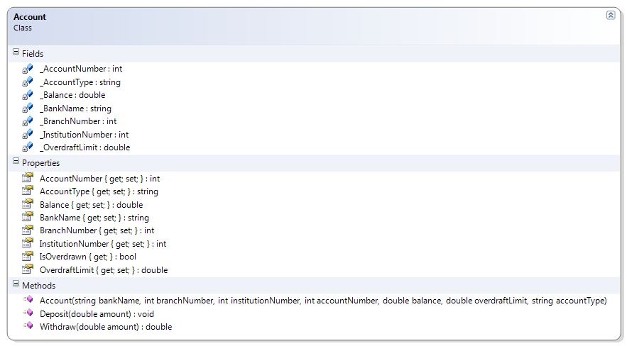

# Account

This class illustrates simple if structure in handling withdrawals; withdrawals are only made when the amount does not exceed the balance and the overdraft. It also identifies if the account is overdrawn. 

**Problem Statement**

Write the code that will represent a simple bank account. The solution must meet the following requirements (new requirements are in bold):

* Should get the bank name, branch number, institution number, account number, balance, overdraft limit, and account type and allow the overdraft limit to be set
* Should support deposits
* **Should only support withdrawals if the amount does not exceed the sum of the balance and the overdraft limit**
* **Should identify if the account is overdrawn**

Use the following class diagram when creating your solution.


 
```csharp
  public double Withdraw(double amount)
  {
      if (amount <= Balance + OverdraftLimit)
          Balance = Balance - amount;
      else
          amount = 0;
      return amount;
  }

  public bool IsOverdrawn
  {
      get
      {
          bool overdrawn;
          if (Balance < 0)
              overdrawn = true;
          else
              overdrawn = false;
          return overdrawn;
      }
  }
```
