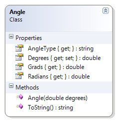

# Angle

This version of the Angle class includes an attribute to identify the type of the angle as either acute, right, obtuse, straight, reflex, full rotation, or undefined. 

**Problem Statement**

Write the code for the Angle class. The solution must meet the following requirements (new requirements are in bold):

* Should get and set the angle's value (in degrees)
* Should calculate the equivalent angle in Radians and Grads, using the following formulas:
  * Radians = Degrees * (π / 180)
  * Grads = Radians * (200 / π)
* Should override the toString() method to return the angle in degrees, in the following format:
  * degrees°
  * The Unicode character for the degrees symbol (°) is '\u00B0'
* **Should get the type of angle, based on the following table**

Angle Range     | Angle Type
----------------|-----------
< = 0 or > 360  | Undefined
> 0 and < 90    | Acute
= 90            | Right
> 90 and < 180  | Obtuse
= 180           | Straight
> 180 and < 360 | Reflex
= 360           | Full Rotation

Use the following class diagram when creating your solution.


 
```csharp
  public string AngleType
  {
      get
      {
          string angleType;
          if (Degrees <= 0)
              angleType = "undefined";
          else if (Degrees < 90)
              angleType = "acute";
          else if (Degrees == 90)
              angleType = "right";
          else if (Degrees < 180)
              angleType = "obtuse";
          else if (Degrees == 180)
              angleType = "straight";
          else if (Degrees < 360)
              angleType = "reflex";
          else if (Degrees == 360)
              angleType = "full rotation";
          else
              angleType = "undefined";
          return angleType;
      }
  }
```
