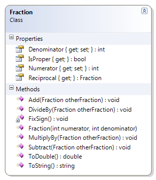

# Fraction

This class now ensures that any negative denominators have their negative sign "moved" to the numerator. It also recognizes whether a fraction is proper (numerator less than denominator) or not and provides a method to express the fraction as a mixed number string. 

**Problem Statement**

Write the code for the Fraction class. The solution must meet the following requirements (new requirements are in bold):

* Should get the string representation of the fraction, as "numerator/denominator"
* Should get the numeric value of the fraction (as a real number)
* Should get the reciprocal of the fraction
* Should get the numerator and denominator
* Should add another fraction to its existing value
* Should subtract another fraction from its existing value
* Should multiply its existing value by another fraction
* Should divide its existing value by another fraction
* **Should affix the sign for negative fractions onto the numerator only**
* **Should identify if the fraction is a proper fraction**
* **Should express the fraction as a mixed number string**

Use the following class diagram when creating your solution.


 
```csharp
    public Fraction(int numerator, int denominator)
    {
        Numerator = numerator;
        Denominator = denominator;
        FixSign();
    }

    private void FixSign()
    {
        if (Denominator < 0)
        {
            Denominator *= -1;
            Numerator *= -1;
        }
    }

    public bool IsProper
    {
        get
        {
            bool proper;
            if (Numerator < Denominator)
                proper = true;
            else
                proper = false;
            return proper;
        }
    }

    public override string ToString()
    {
        string stringValue = "";
        if(IsProper)
            stringValue += (Numerator / Denominator) + " and " 
                         + (Numerator % Denominator) + "/" + Denominator;
        else
            stringValue += Numerator + "/" + Denominator;
        return stringValue;
    }
```
