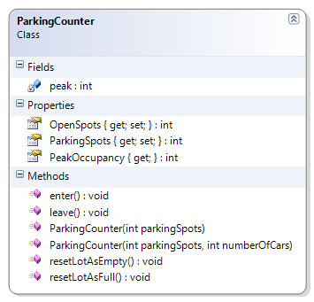

---
---
# ParkingCounter

This class represents a simple counter to monitor whether a parking lot is full or not; it tracks vehicles entering and leaving the parking lot and allows the counter to be reset when the lot is full or empty. This class illustrates increment and decrement operators and/or the assignment increment or assignment decrement operators.

**Problem Statement**

Write the code that will monitor vehicles entering and leaving a parking lot. The solution must meet the following requirements (new requirements are in bold):

* Should track vehicles entering
* Should track vehicles leaving
* **Should track the peak occupancy of the parking lot**
  * **The peak occupancy represents the highest number of cars in the parking lot at any one time**
* Should get total parking spots
* Should get open (empty) spots
* Should reset lot as full (that is, fill the parking lot)
* Should reset lot as empty (that is, clear all the parking spots of vehicles)

Use the following class diagram when creating your solution.


 
```csharp
    public int PeakOccupancy { get; private set; }

    public ParkingCounter(int parkingSpots)
    {
        this.ParkingSpots = parkingSpots;
        this.OpenSpots = parkingSpots;
        this.PeakOccupancy = 0;
    }

    public ParkingCounter(int parkingSpots, int numberOfCars)
    {
        this.ParkingSpots = parkingSpots;
        this.OpenSpots = this.ParkingSpots - numberOfCars;
        this.PeakOccupancy = numberOfCars;
    }

    public void enter()
    {
        OpenSpots--;
        int numberOfCars = ParkingSpots - OpenSpots;
        if (numberOfCars > PeakOccupancy)
            PeakOccupancy = numberOfCars;
    }
```
