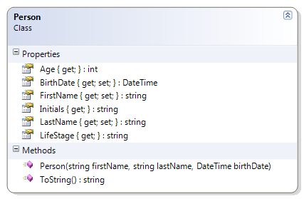

---
---
# Person

This adaptation of the person class checks the age of the person to see if the person's life stage is infant, toddler, preschooler, school age, or adult.

**Problem Statement**

Write the code that will represent a person with a first and last name and a date of birth. The solution must meet the following requirements (new requirements are in bold):

* Should get and set the first and last name
* Should get the birth date
* Should get the person’s approximate age (which is the age that the person will turn to in the current year)
* Should override ToString() to get the person’s full name (as first name then last name)
* **Should get the life stage, based on the following table**

Age Range (Years) | Life Stage
------------------|-----------
0                 | Infant
< 3               | Toddler
< 5               | Preschooler
< 18              | School age
>= 18             | Adult

Use the following class diagram when creating your solution.


 
```csharp
  public string LifeStage
  {
    get{
      string stage;
      if (Age == 0)
          stage = "infant";
      else if (Age < 3)
          stage = "toddler";
      else if (Age < 5)
          stage = "preschooler";
      else if (Age < 18)
          stage = "school age";
      else
          stage = "adult";
      return stage;
    }
  }
```
