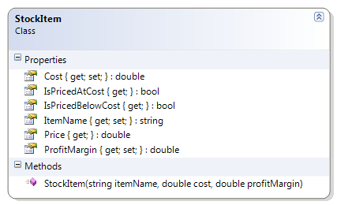

# StockItem

This class represents an item that is part of an inventory. The item has an item name, a cost and a profit margin (which can be positive or negative). By using the profit margin, it can derive the price of the item. The class can also report if the item is priced at or below cost.

**Problem Statement**

Write the code for the StockItem class. The solution must meet the following requirements (new requirements are in **bold**):

* Should get and set the name, cost and profit margin of the stock item
* Should calculate the price of the item, to the nearest cent, using the profit margin as a percent (a profit margin of 45 means 45%)
  * Use the rounding where values under a half-cent are rounded down and values greater than or equal to a half-cent are rounded up
* **Should recognize when the stock item is priced at cost (that is, the profit margin is zero)**
* **Should recognize when the stock item is priced below cost (that is, the profit margin is negative)**

Use the following class diagram when creating your solution.



```csharp
  public bool IsPricedAtCost
  {
      get
      {
          bool atCost = false;
          if (ProfitMargin == 0)
              atCost = true;
          return atCost;
      }
  }

  public bool IsPricedBelowCost
  {
      get
      {
          bool belowCost;
          if (ProfitMargin < 0)
              belowCost = true;
          else
              belowCost = false;
          return belowCost;
      }
  }
```
