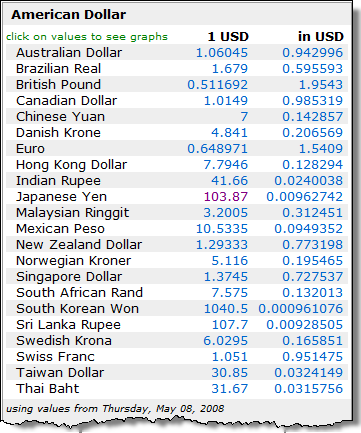
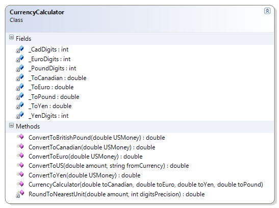

# CurrencyCalculator

This exercise extends the previous CurrencyCalculator exercise by allowing the conversion from a foreign currency to US dollars.

**Problem Statement**

A currency exchange store at the international airport needs a program to convert from US dollars to four other currencies: Canadian dollar, Euro, Japanese Yen, and the Great Britain Pound. The store uses a set exchange rate for each currency as established at the start of the day. Write the code for a class called CurrencyCalculator to meet this need. The solution must meet the following requirements (new requirements are in **bold**):

* Should correctly convert US dollars to the 
  * British Pound (GBP)
  * Canadian Dollar (CAD)
  * Euro (EUR)
  * Japanese Yen (JPY)
* **Should convert an amount to US dollars from any of the supported currencies (GBP, CAD, JPY, and EUR)**
* Should use the correct level of precision when making the exchange; each currency uses a different number of significant digits:
  * CAD, GBP and EUR use two digits
  * JPY uses three digits

To illustrate the possible exchange rates, please refer to the following images.

{caption:"Currency exchange rates sourced from http://www.x-rates.com:}

 
 
Use the following class diagram when creating your solution.

