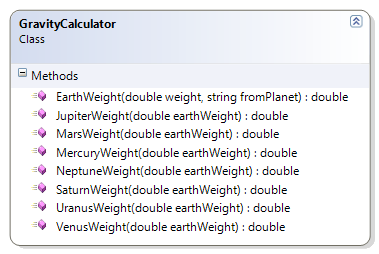

---
---
# GravityCalculator

This exercise extends the previous GravityCalculator exercise by allowing the conversion to a weight on Earth from a weight on another planet in our solar system.

**Problem Statement**

Write the code needed to convert Earth weights to their equivalent for the other planets in our solar system. The solution must meet the following requirements (new requirements are in **bold**):

* Should convert a weight in Earth kilograms to their equivalent weight on
  * Mercury
  * Venus
  * Mars
  * Jupiter
  * Saturn
  * Uranus
  * Neptune
* **Should convert a weight from a specific planet back to the equivalent weight on Earth**

Use the following class diagram when creating your solution.

