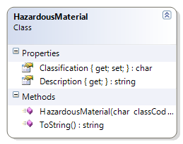

# HazardousMaterial

The HazardousMaterial class is a simple representation of the six main classes of hazardous materials (A through F). This class maps a classification code with a general description of the material’s classification:

* **Class A** – Compressed Gas
* **Class B** – Flammable and Combustible Material
* **Class C** – Oxidizing Material
* **Class D** – Poisonous and Infectious Material
* **Class E** – Corrosive Material
* **Class F** – Dangerously Reactive Material

**Problem Statement**

Write the code for the HazardousMaterial class. The solution must meet the following requirements:

* Should return the class code as the classification
* Should get the description for the class, based on the following table

Class Code | Description
-----------|-----------------------------------
A          | Compressed Gas
B          | Flammable and Combustible Material
C          | Oxidizing Material
D          | Poisonous and Infectious Material
E          | Corrosive Material
F          | Dangerously Reactive Material

* Should override the ToString() method to get the full description and class code in the following format:
* "Class ClassCode - Description"

Use the following class diagram when creating your solution.
 

