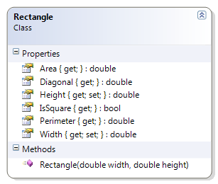

# Rectangle

"All squares are rectangles, but not all rectangles are squares." This class represents a simple rectangle with a height and width. From this information, the area, perimeter and diagonal can be obtained; it can also be determined if the rectangle is or is not square.

**Problem Statement**

Write the code for the Rectangle class. The solution must meet the following requirements:

* Should get and set the height and the width
* Should calculate the area, the perimeter and the diagonal
* The formula for the diagonal is √(〖width〗^2  + 〖height〗^2 )
* Should determine if the rectangle is a square

Use the following class diagram when creating your solution.

