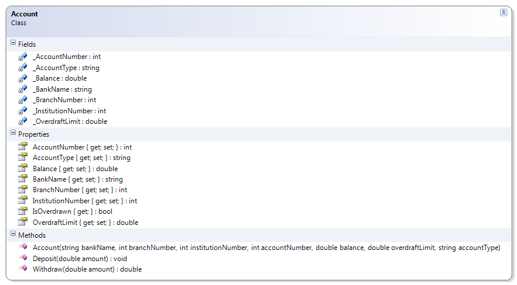

# Account

The following account information is now verified when the class is created:

a. Bank name and account type cannot be empty
b. The opening balance must be greater than zero
c. The overdraft limit cannot be negative
d. The institution number must be 3 digits
e. The branch number must be 6 digits
f. Attempts to withdraw amounts beyond the overdraft limit should throw an "Insufficient Funds" exception

**Problem Statement**

Write the code that will add validation to the Account class. The solution must meet the following requirements (new requirements are in **bold**):
* Should get the bank name, branch number, institution number, account number, balance, overdraft limit, and account type and allow the overdraft limit to be set
* Should support deposits
* Should only support withdrawals if the amount does not exceed the sum of the balance and the overdraft limit, **otherwise an exception stating "Insufficient Funds" should occur**
* **Should identify if the account is overdrawn**
* **Should require bank name and account type (that is, they cannot be empty or null)**
* **Should trim the bank name and account type**
* **Should verify that the branch number is six digits and the institution number is three digits**
* **Should require an opening balance**
* **Should not allow a negative overdraft limit**

Use the following class diagram when creating your solution.


 
```csharp
    public double Balance
    {
        get { return _Balance; }
        set {
            if (value < -OverdraftLimit)
                throw new Exception("Negative balances cannot exceed the Overdraft Limit");
            _Balance = value;
        }
    }

    public double OverdraftLimit
    {
        get { return _OverdraftLimit; }
        set
        {
            if (value < 0)
                throw new Exception("Negative overdraft limits not allowed");
            _OverdraftLimit = value;
        }
    }

    public int BranchNumber
    {
        get { return _BranchNumber; }
        set {
            if (value < 10000 || value > 99999)
                throw new Exception("Branch number must be 5 digits");
            _BranchNumber = value;
        }
    }

    public int InstitutionNumber
    {
        get { return _InstitutionNumber; }
        set
        {
            if (value < 100 || value > 999)
                throw new Exception("InstitutionNumber must be a three-digit value");
            _InstitutionNumber = value;
        }
    }

    public string AccountType
    {
        get { return _AccountType; }
        set {
            if (string.IsNullOrEmpty(value) || string.IsNullOrEmpty(value.Trim()))
                throw new Exception("Account type cannot be empty");
            _AccountType = value.Trim();
        }
    }

    public string BankName
    {
        get { return _BankName; }
        set
        {
            if (string.IsNullOrEmpty(value) || string.IsNullOrEmpty(value.Trim()))
                throw new Exception("BankName is required");
            _BankName = value.Trim();
        }
    }

    public Account(string bankName, int branchNumber, int institutionNumber, int accountNumber, double balance, double overdraftLimit, string accountType)
    {
        if (balance <= 0)
            throw new Exception("Opening balance must be greater than zero");
        if (balance != Math.Round(balance, 2))
            throw new Exception("Opening balances cannot include a fraction of a penny");
        if (overdraftLimit != Math.Round(overdraftLimit, 2))
            throw new Exception("Overdraft limit amounts cannot include a fraction of a penny");
        AccountNumber = accountNumber;
        Balance = balance;
        OverdraftLimit = overdraftLimit;
        BankName = bankName;
        BranchNumber = branchNumber;
        InstitutionNumber = institutionNumber;
        AccountType = accountType;
    }

    public double Withdraw(double amount)
    {
        if (amount != Math.Round(amount, 2))
            throw new Exception("Withdrawal amounts cannot include fractions of a penny");
        if (amount > Balance + OverdraftLimit)
            throw new Exception("Insufficient Funds");
        if (amount <= Balance + OverdraftLimit)
            Balance = Math.Round(Balance - amount, 2);
        else
            amount = 0;
        return amount;
    }

    public void Deposit(double amount)
    {
        if (amount != Math.Round(amount, 2))
            throw new Exception("Deposit amounts cannot include fractions of a penny");
        Balance = Math.Round(Balance + amount, 2);
    }
```
