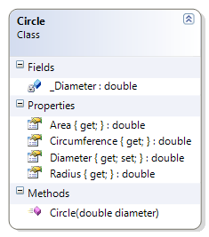

# Circle

Only accepts positive, non-zero diameters.

**Problem Statement**

Write the code for the Circle class. The solution must meet the following requirements (new requirements are in **bold**):

* Should get and set the diameter
* Should calculate the area, radius, and circumference
* **Should only accept positive, non-zero lengths for the diameter**

Use the following class diagram when creating your solution.


 
```csharp
    private double _Diameter;
    public double Diameter
    {
        get
        {
            return _Diameter;
        }
        set
        {
            if (value <= 0)
                throw new System.Exception("Diameter must be a positive non-zero value");
            _Diameter = value;
        }
    }
```
