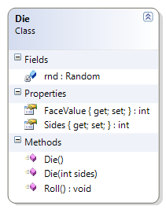

---
---
# Die

Only accepts from 4 to 20 sides for a die. This class represents a single six-sided die. This example is used to illustrate random number generation and casting.

**Problem Statement**

Write the code for the Die class. The solution must meet the following requirements (new requirements are in **bold**):

* Should generate a random value from 1 to the number of sides on the die, when initially created and when re-rolled
* Should get the face value of the die
* Should get the number of sides of the die
* Should randomly generate each side (if rolled enough); for example, if the die has ten sides, it should eventually roll a 1, 2, 3, 4, 5 6, 7, 8, 9, and 10
* **Should only accept 4 to 20 sides for the die**

Use the following class diagram when creating your solution.


 
```csharp
    public Die(int sides)
    {
        if (sides < 4 || sides > 20)
            throw new System.Exception("A die can only have from 4 to 20 sides");
        this.Sides = sides;
        Roll();
    }
```
