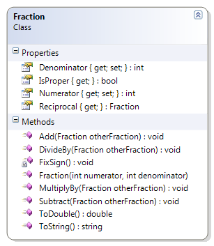

# Fraction

The fraction class avoids the division by zero error by ensuring that the supplied denominator is not zero.

**Problem Statement**

Write the code for the Fraction class. The solution must meet the following requirements (new requirements are in **bold**):
* Should get the string representation of the fraction, as "numerator/denominator"
* Should get the numeric value of the fraction (as a real number)
* Should get the reciprocal of the fraction
* Should get the numerator and denominator
* Should add another fraction to its existing value
* Should subtract another fraction from its existing value
* Should multiply its existing value by another fraction
* Should divide its existing value by another fraction
* Should affix the sign for negative fractions onto the numerator only
* Should identify if the fraction is a proper fraction
* **Should reject zero denominators**

Use the following class diagram when creating your solution.


 
```csharp
    public Fraction(int numerator, int denominator)
    {
        if (denominator == 0)
            throw new System.Exception("A fraction cannot have a denominator of zero (0)");
        Numerator = numerator;
        Denominator = denominator;
        FixSign();
    }
```
