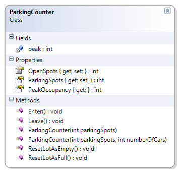

# ParkingCounter

Only accepts positive, non-zero counts for available parking spaces and number of cars. Also, the number of cars must not exceed the number of parking spaces. The rules for the number of cars must also apply for cars entering and leaving the parking lot.

**Problem Statement**

Write the code that will monitor vehicles entering and leaving a parking lot. The solution must meet the following requirements (new requirements are in **bold**):

* Should track vehicles entering
* Should track vehicles leaving
* Should track the peak occupancy of the parking lot
  * The peak occupancy represents the highest number of cars in the parking lot at any one time
* Should get total parking spots
* Should get open (empty) spots
* Should reset lot as full (that is, fill the parking lot)
* Should reset lot as empty (that is, clear all the parking spots of vehicles)
* **Should only allow a positive (non-zero) number of parking spots**
* **Should not allow a negative number of cars (when using the overloaded constructor), and should not allow more cars than parking spots**
* **Should not allow available (open) parking spots to go negative or to exceed the actual number of parking spots**
  * **Should raise an error when trying to enter a full parking lot**
  * **Should raise an error if trying to leave a parking lot that is already empty**

Use the following class diagram when creating your solution.



```csharp
    public ParkingCounter(int parkingSpots)
    {
        if (parkingSpots <= 0)
            throw new System.Exception("Negative or zero parkingSpots not allowed");
        this.ParkingSpots = parkingSpots;
        this.OpenSpots = parkingSpots;
        this.peak = 0;
    }

    public ParkingCounter(int parkingSpots, int numberOfCars)
    {
        if (parkingSpots <= 0)
            throw new System.Exception("Negative or zero parkingSpots not allowed");
        if (numberOfCars < 0)
            throw new System.Exception("Negative numberOfCars not allowed");
        if (numberOfCars > parkingSpots)
            throw new System.Exception("The number of cars cannot exceed the number of parking spots");
        this.ParkingSpots = parkingSpots;
        this.OpenSpots = this.ParkingSpots - numberOfCars;
        this.peak = numberOfCars;
    }

    public void leave()
    {
        if (OpenSpots == ParkingSpots)
            throw new System.Exception("Parking lot is empty");
        OpenSpots++;
    }

    public void enter()
    {
        if (OpenSpots == 0)
            throw new System.Exception("Parking lot is full");
        OpenSpots--;
        int numberOfCars = ParkingSpots - OpenSpots;
        if (numberOfCars > peak)
            peak = numberOfCars;
    }
```
