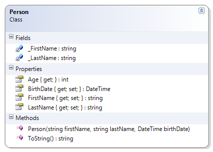

---
---
# Person

First and last names cannot be empty and the birth date cannot be in the future. This illustrates putting the validation on the setters and calling the setters from the constructor (to reduce the duplication of code).

This adaptation of the person class includes a check of the age of the person to see if the person's life stage is infant, toddler, preschooler, school age, or adult.

**Problem Statement**

Write the code that will represent a person with a first and last name and a date of birth. The solution must meet the following requirements (new requirements are in **bold**):

* Should get and set the first and last name
* Should get the birth date
* Should get the person's approximate age (which is the age that the person will turn to in the current year)
* Should override toString() to get the person's full name (as first name then last name)
* Should get the life stage, based on the following table

Age Range (Years) | Life Stage
------------------|-------------
0                 | Infant
< 3               | Toddler
< 5               | Preschooler
< 18              | School age
>= 18             | Adult

* **Should ensure the first and last names are not empty (or null)**
* **Should trim leading and trailing spaces from the first and last names**
* **Should reject birthdates that are in the future**

Use the following class diagram when creating your solution.


 
```csharp
    private string _FirstName;
    public string FirstName
    {
        get
        {
            return _FirstName;
        }
        set
        {
            if (string.IsNullOrEmpty(value) || string.IsNullOrEmpty(value.Trim()))
                throw new Exception("FirstName cannot be empty");
            _FirstName = value.Trim();
        }
    }

    private string _LastName;
    public string LastName
    {
        get
        {
            return _LastName;
        }
        set
        {
            if (string.IsNullOrEmpty(value) || string.IsNullOrEmpty(value.Trim()))
                throw new Exception("LastName cannot be empty");
            _LastName = value.Trim();
        }
    }

    public Person(string firstName, string lastName, DateTime birthDate)
    {
        if (birthDate.CompareTo(DateTime.Today) > 0)
            throw new System.Exception("Birthdates in the future are not allowed");
        FirstName = firstName;
        LastName = lastName;
        BirthDate = birthDate;
    }
```
